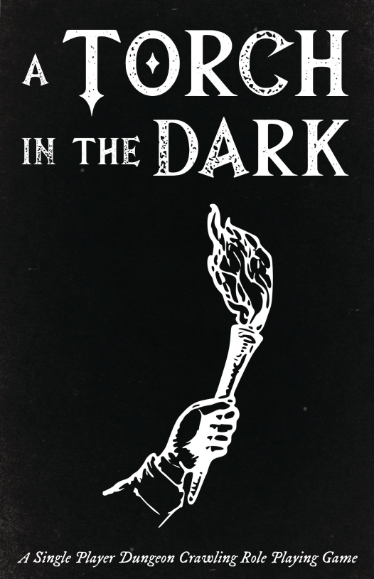
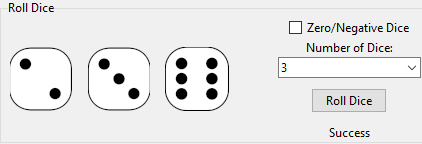
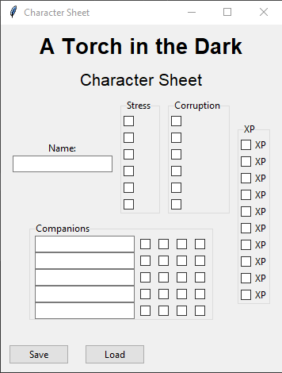

# Torch in the Dark (TITD) Automation
Automate Torch in the Dark, a Python program designed to enhance gameplay experience.

## Introduction
Torch in the Dark (TITD) is a popular solo rpg that you enjoy playing. This Python program aims to streamline and automate certain aspects of the game to make it even more enjoyable and efficient so you can play it anywhere.  This program is currently a work in progress.  

## Features
- **Shuffle Deck**: Automatically shuffle the deck of cards for the game.
- **Draw Card**: Draw a card from the shuffled deck and display it.
- **Roll Dice**: Simulate rolling dice with customizable options.
- **Character Sheet**: Manage character data with stress, corruption, companions, and more.
- **Reference Image**: Display a reference image to help players during the game.

## Installation and Usage
1. Clone this repository.
2. Install the required dependencies: [List of dependencies and installation instructions].
3. Run the Python program: `python main.py`.
4. Follow the on-screen instructions to use different features.

## Screenshots

## Contributing
If you'd like to contribute to this project, feel free to submit a pull request or open an issue.

## License
This project is licensed under the [MIT License](./LICENSE).

---

*Note: The above instructions and examples are for illustrative purposes. Please provide accurate installation instructions and dependencies specific to your project.*

[GitHub Repository](https://github.com/Majician13/TITD)
